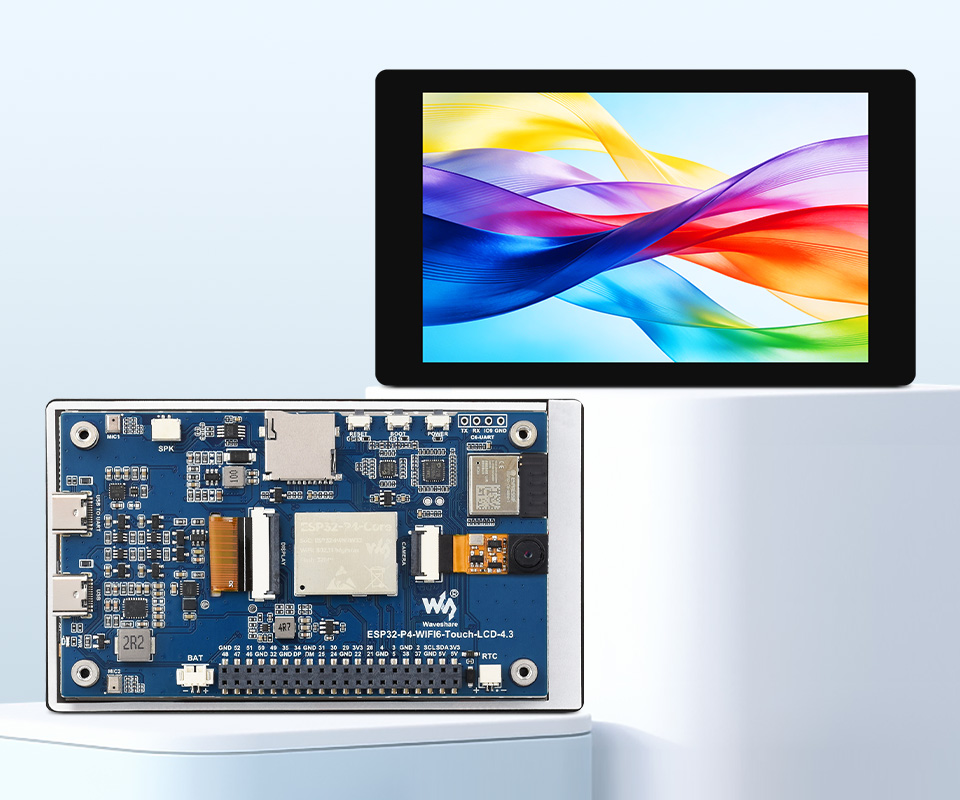

  <h1>ESP32-P4-WIFI6-Touch-LCD-4.3</h1>
  
<strong>由 ESP32-P4 与 ESP32-C6 驱动的 4.3 英寸 480 × 800 MIPI-DSI 触摸开发板</strong>

  

    
    
  

  

    <a href="README.md">English</a> ·
    <a href="https://www.waveshare.net/shop/ESP32-P4-WIFI6-Touch-LCD-4.3.htm">🌐 产品页面</a> ·
    <a href="https://docs.waveshare.net/ESP32-P4-WIFI6-Touch-LCD-4.3/">📚 产品文档</a> ·
    <a href="firmware/">📦 出厂固件</a> ·
    <a href="examples/esp-idf/">🧩 ESP-IDF 示例</a> ·
    <a href="docs/README_ZH.md">📖 仓库指南</a>
  

  

---

## ✨ 概述

本仓库提供适用于 Waveshare ESP32-P4-WIFI6-Touch-LCD-4.3 的 ESP-IDF 示例、
出厂恢复镜像和产品原理图。

该开发板集成 ESP32-P4 应用处理器与 ESP32-C6 无线协处理器，并配备竖屏
4.3 英寸电容触摸显示屏、音频输入输出、摄像头和 USB 接口、MicroSD 存储及
40PIN 扩展接口，适用于多媒体界面、边缘应用、智能终端和人机交互项目。

## 🖥️ 硬件概览

| 功能 | 器件 / 接口 |
| --- | --- |
| 主处理器 | ESP32-P4NRW32，双核高性能及单核低功耗 RISC-V CPU |
| 存储 | 封装内 32 MB PSRAM 和外置 32 MB NOR Flash |
| 无线连接 | ESP32-C6-MINI-1，通过 SDIO 通信，提供 2.4 GHz Wi-Fi 6 和 Bluetooth 5 (LE) |
| 显示屏 | 4.3 英寸 480 × 800 IPS LCD，2-lane MIPI-DSI，ST7701 控制器 |
| 触摸 | GT911 电容触摸控制器，最多支持五点触控 |
| 音频 | ES8311 音频编解码器、ES7210 音频前端、双板载麦克风和扬声器接口 |
| 摄像头 | 15PIN 2-lane MIPI-CSI 接口，可选配 OV5647 摄像头 |
| 存储卡 | MicroSD 卡槽，采用四线 SDIO 3.0 |
| USB | USB 2.0 High-Speed OTG 和 USB 转 UART Type-C 接口 |
| 扩展 | 40PIN GPIO 接口，可通过转接方式兼容部分树莓派 HAT |
| 硬件文件 | [产品原理图](schematic/ESP32-P4-WIFI6-Touch-LCD-4.3-schematic.pdf) |

完整规格、接口说明和安全操作方法请参阅
[官方产品文档](https://docs.waveshare.net/ESP32-P4-WIFI6-Touch-LCD-4.3/)。
CI 仅证明源码编译兼容性；硬件引脚和时序还应结合原理图与实际硬件版本验证。

## 📦 出厂固件

[`firmware/ESP32-P4-WIFI6-Touch-LCD-4.3-FactoryOnly-260206.bin`](firmware/ESP32-P4-WIFI6-Touch-LCD-4.3-FactoryOnly-260206.bin)
是仓库中提供的出厂及恢复镜像。它不是示例构建工作流生成的产物，也不应被视为
ESP-IDF 示例固件。

请按照官方产品文档使用正确的烧录工具、偏移地址和恢复流程。该出厂镜像的源码和
构建说明尚未包含在本仓库中，后续更新可能会补充相关内容。

## 🧪 ESP-IDF 示例

| 示例 | 功能 |
| --- | --- |
| [01_HowToCreateProject](examples/esp-idf/01_HowToCreateProject/) | ESP-IDF 工程结构与组件管理入门 |
| [02_HelloWorld](examples/esp-idf/02_HelloWorld/) | 基础构建、烧录和串口监视流程 |
| [03_i2c_tools](examples/esp-idf/03_i2c_tools/) | I2C 总线检测与设备扫描 |
| [04_wifistation](examples/esp-idf/04_wifistation/) | 通过 ESP32-C6 Hosted 连接接入 Wi-Fi |
| [05_sdmmc](examples/esp-idf/05_sdmmc/) | 通过 SDMMC 访问板载 MicroSD 卡 |
| [06_I2SCodec](examples/esp-idf/06_I2SCodec/) | ES8311 音频播放和麦克风回放 |
| [07_Displaycolorbar](examples/esp-idf/07_Displaycolorbar/) | MIPI-DSI 显示初始化和彩条测试 |
| [08_lvgl_demo_v9](examples/esp-idf/08_lvgl_demo_v9/) | LVGL 9 显示与触摸示例 |
| [09_video_lcd_display](examples/esp-idf/09_video_lcd_display/) | MIPI-CSI 摄像头画面显示到 MIPI-DSI 屏幕 |
| [10_mp4_player](examples/esp-idf/10_mp4_player/) | 从 MicroSD 卡播放 MP4 视频 |
| [11_esp_brookesia_phone](examples/esp-idf/11_esp_brookesia_phone/) | ESP-Brookesia 多媒体用户界面 |
| [12_usb_extend_screen](examples/esp-idf/12_usb_extend_screen/) | USB 扩展屏与触摸输入回传 |

请结合各示例内容和官方产品文档确认外设及媒体文件要求。CI 用于验证编译，不能替代
目标开发板和外接配件上的实际运行测试。

## 🛠️ 持续集成

| 开发框架 | 版本 | 默认构建 | 条件配置构建 |
| --- | --- | ---: | ---: |
| ESP-IDF | `v5.5.4` | 12 | 8 |
| ESP-IDF | `v6.0.2` | 12 | 8 |

[ESP-IDF 示例工作流](.github/workflows/esp-idf-examples.yml)会发现
`examples/esp-idf/` 下 12 个直接第一方工程。完整源码运行包含 1 个预检任务和
40 个构建任务：24 个默认配置，以及 RGB888、Brookesia AI 与 USB 最小配置。
仅文档修改只运行预检；出厂固件修改会提示发布审核，但不会作为示例源码处理。未知路径
会触发完整矩阵，差异为空或无法读取时则直接失败。路由与证据边界详见
[CI 指南](docs/CI_ZH.md)。

## 🗂️ 仓库结构

| 路径 | 用途 |
| --- | --- |
| [`examples/esp-idf/`](examples/esp-idf/) | 第一方 ESP-IDF 工程 |
| [`firmware/`](firmware/) | 仓库内提供的出厂及恢复镜像 |
| [`schematic/`](schematic/) | 产品原理图 |
| [`assets/`](assets/) | 文档使用的产品图片 |
| [`config/ci/`](config/ci/) | 仅供 Actions 使用的条件 sdkconfig 覆盖配置 |
| [`docs/`](docs/) | 仓库 CI、组件和硬件维护指南 |
| [`.github/`](.github/) | CI 工作流及示例发现逻辑 |

## 📚 文档

- [中文产品文档](https://docs.waveshare.net/ESP32-P4-WIFI6-Touch-LCD-4.3/)
- [English Product Documentation](https://docs.waveshare.com/ESP32-P4-WIFI6-Touch-LCD-4.3)
- [产品原理图](schematic/ESP32-P4-WIFI6-Touch-LCD-4.3-schematic.pdf)
- [ESP-IDF 示例](examples/esp-idf/)
- [仓库指南](docs/README_ZH.md)
- [持续集成](docs/CI_ZH.md)
- [组件边界](docs/COMPONENTS_ZH.md)
- [硬件审计](docs/HARDWARE_ZH.md)
- [English README](README.md)

## 🤝 支持与贡献

欢迎提交贡献和可复现的问题报告。请提供产品及硬件版本、示例路径、ESP-IDF 版本、
复现步骤、预期行为、实际行为以及相关构建或串口日志。修改本地组件或出厂固件前请先
检查仓库边界。

- [贡献指南](CONTRIBUTING_ZH.md)
- [支持策略](SUPPORT_ZH.md)
- [提交 Issue](https://github.com/waveshareteam/ESP32-P4-WIFI6-Touch-LCD-4.3/issues)
- [微雪技术支持](https://www.waveshare.net/help_center/contact.htm)

## 📄 许可证

本仓库基于 Apache License 2.0 许可。详情请参阅
[LICENSE.txt](LICENSE.txt)。
